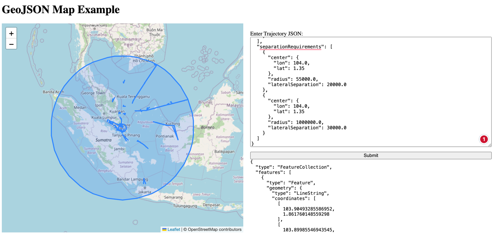
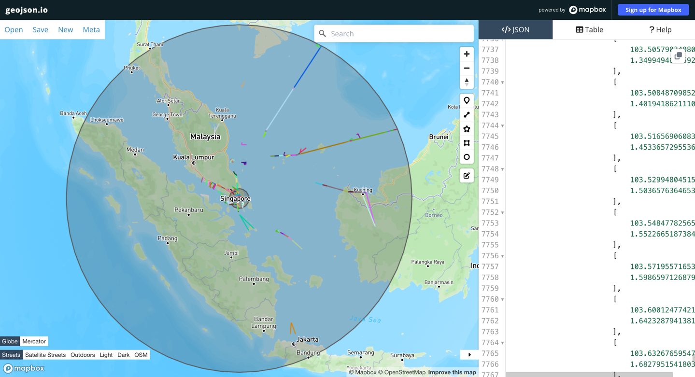

# Aircraft Lateral separation Conflicts
Aircraft lateral separation conflict algorithm analysis and visualization

## Getting Started

To get the project up and running on your local development environment, follow these steps:

### Prerequisites

Before you begin, make sure you have the following software installed:

- Java Development Kit (JDK), Java 11
- Kotlin
- Gradle

### Clone the Repository

- run:
`git clone -b feature-backend https://github.com/kaiabco1996/conflict-forecast.git`

### Install Dependencies
Please find the dependencies on the pom.xml
To install all the dependencies please run the following:

`./gradlew build`

### Configure the Application

1. Open the project in your preferred IDE.

### Run the Application

- In your IDE, locate the main class of the application (ConflictForecastApplication.kt).
- Run the main class to start the Spring Boot application.

Alternatively, you can run the following command in the project's root directory:

`./gradle bootRun`

The application should now be running locally on your development environment. You can access it by Postman and navigating to the specified URL or API endpoints in the postman collections.

Please find the swagger file at 

`conflict-forecast-api-swagger.json`

## Usage

### API Endpoints

The application provides the following API endpoints:

- `POST /v1/forecast/conflicts`: Retrieves a list of conflicting aircraft trajectories based on the lateral distance and separation region each aircraft belongs to (brute force method).
- `POST /v1/forecast/conflict-features`: Retrieves GeoJson Formatted conflicting trajectories of aircrafts and their separation regions(brute force method).
- `POST /v2/forecast/conflicts`: Retrieves a list of conflicting aircraft trajectories based on the lateral distance and separation region each aircraft belongs to (more performant method).
- `POST /v1/forecast/conflict-features`: Retrieves GeoJson Formatted conflicting trajectories of aircrafts and their separation regions(more performant method).

In order to Simply use the application from the FrontEnd, simply hit the following url: http://localhost:8080/
which will load the static html capable of loading a map with the features of the conflicts and separation regions given the default request json.
### Examples

#### Retrieve a list of conflicts

- To retrieve a list of conflicts, send a POST request to the `/v1/forecast/conflicts` endpoint:

- The sample request body json can be obtained from the file path `src/test/resources/requests/demo-request-1.json`

- One should obtain a response same as that in the file `src/test/resources/responses/demo-response-1.json`

#### Retrieve a GeoJson Features
- To retrieve a list of conflicts, send a POST request to the `/v1/forecast/conflict-features` endpoint:

- The sample request body json can be obtained from the file path `src/test/resources/requests/demo-request-1.json`

- One should obtain a response same as that in the file `src/test/resources/responses/demo-feature-response-1.json`

- To visualize one can go ahead to [geojson.io](https://geojson.io) and copy paste our output response body features.

#### Load GeoJson on Map from browser
- paste the following url into your browser http://localhost:8080/
- Upon the loading of the empty map, paste the request json into the input box and press the button to process
- Once processing is done the resulting features are displayed at the bottom of the input box and the features are 
displayed on the map zoomed into the features.
- A sample image of the output from the frontend web is as shown 
- However, our current implementation on the custom front end still does not include the color variation capabilities in geojson
- The following image shows the geojson.io website's output of our conflict features where two aircrafts intersecting have the same color and all other pairs have other random colors
- 